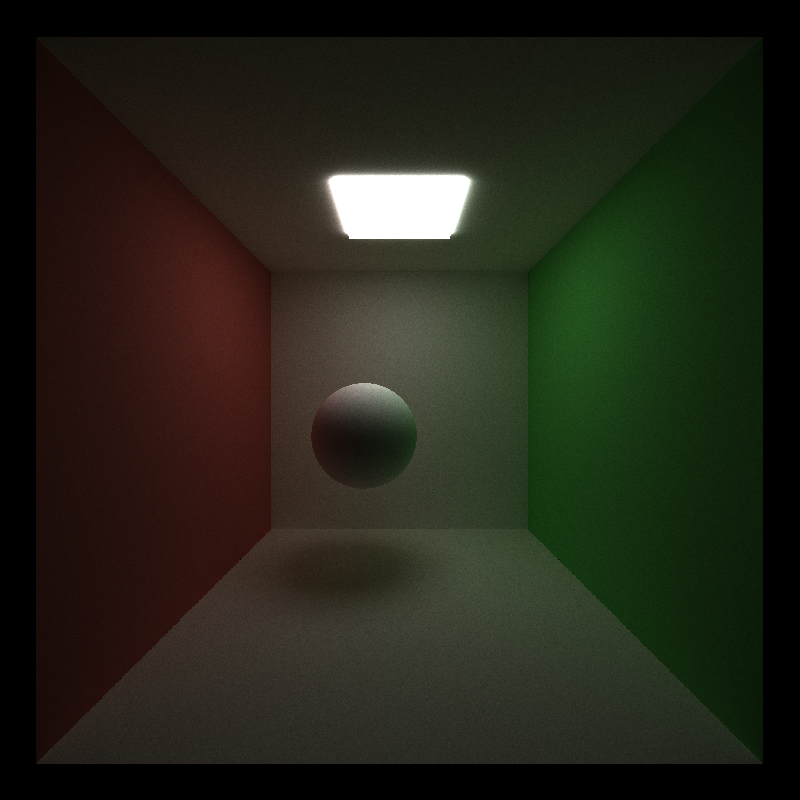
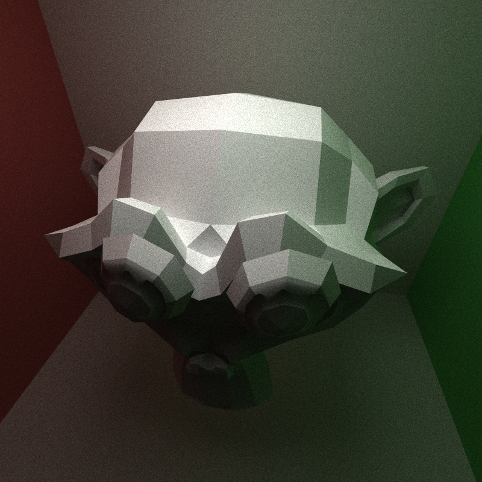
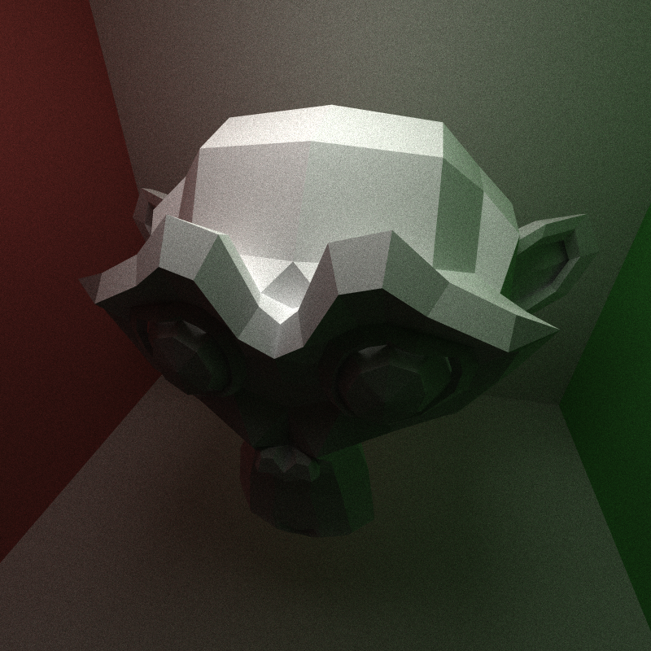

CUDA Path Tracer
================

**University of Pennsylvania, CIS 5650: GPU Programming and Architecture, Project 3**

* Charles Wang
  * [LinkedIn](https://linkedin.com/in/zwcharl)
  * [Personal website](https://charleszw.com)
* Tested on:
  * Windows 11 Pro (26100.4946)
  * Ryzen 5 7600X @ 4.7Ghz
  * 32 GB RAM
  * RTX 5060 Ti 16 GB (Studio Driver 581.29)

# CUDA Path Tracer

> [!NOTE]
> I've significantly updated and refactored the base homework code. See instructions for [building](#building) below, as well as the [file list](#file-list).

## Program structure

- Path tracer is run for a certain number of iterations. This is determined by the scene file we're currently running
- Each iteration, represented by one call to `PathTracer::run_iteration`, first generates the initial set of rays coming out of the camera
- Then we enter a loop that does the following:
  - Using the calculated rays, compute potential intersections with the scene
  - Stream compaction away dead paths, i.e. paths that did not intersect with anything or went out of bounds
  - Add the light and color contribution to the path
  - Determine the next ray to travel to
- We exit the loop if we've either hit the max accepted depth (this should be kinda rare) or we've stream compacted away all paths (more likely to occur)
- Gather pixel color from each path by appending it to all previous contributions and display it

### File list

To better understand the role each file plays, here I offer a description of each.

## Features

Roughly organized in chronological order of when I first implemented it.

### New materials

#### Cosine-weighted hemisphere sampling and Lambertian diffuse materials

After playing with the base code a bit and getting a sense of the overall project structure, I implemented my first material, a very simple Lambertian diffuse shading model.

- probably some explanation of what it is
- BSDF is constant with respect to the incident angle, and is simply $\frac{\text{albedo}}{\pi}$

A function for cosine-weighted hemisphere sampling was already provided for us, so I didn't bother trying uniform hemisphere sampling first. The PDF for cosine-weighted sampling is given by $\frac{\text{abs}(\cos{\theta})}{\pi}$, which we also have to consider in the lighting equation.

- probably explain why cosine-weighted hemisphere sampling is better than uniform sampling

Then, the overall throughput contribution for this intersection is given by `bsdf * lambert / pdf`, where `lambert` is simply $\text{abs}(\cos{\theta})$.[^1] With no other changes, testing on the default `cornell.json` scene gives us this:



5000 iterations.

#### Perfectly specular dielectrics

Prior to achieving dieletrics, I first had to write the BRDF and BTDF components. Although these materials can't exist in real life, they still look "realistic" and I created these test scenes to check my implementation:

- Complete reflection
- Complete transmission

Resources used:

- https://pbr-book.org/4ed/Reflection_Models/Specular_Reflection_and_Transmission
- https://pbr-book.org/4ed/Reflection_Models/Dielectric_BSDF

##### Computing the Fresnel reflectance term

Both are implemented. Schlick promises to be faster. Is this true?

Schlick's approximation:

- https://en.wikipedia.org/wiki/Schlick's_approximation
- https://umbcgaim.wordpress.com/2010/07/15/fresnel-environment/
- https://link.springer.com/chapter/10.1007/978-1-4842-7185-8_9

### Discarding paths

TODO(aczw): use difference as metric to measure how effective sampling methods are?

#### Partitioning the paths

I essentially discard paths we don't need to perform additional computations on by partitioning the buffer, separating paths that are still "active" and those that aren't. I currently do this in two phases:

- Discarding paths that went out of bounds (OOB)
- Discarding paths that have intersected with a light

The benefits are twofold: I've rearranged the active paths such that they're now contiguous in the buffer. This also allows me to dynamically adjust the number of blocks I need when configuring the launch parameters for my intersection and shading kernels.

- For scenes that are less bounded by walls and have more open space, discarding OOB rays improves performance by a lot.
- Similarly, scenes that may contain a large number of lights will benefit from the ray light intersection discarding step.

TODO(aczw): comparison graphs, create scenes that demonstrate this LOL

### Sorting paths by intersection material

Another optimization I made is to keep paths that intersected the same material contiguous in the buffer. I reference the material at an intersection via a `material_id`, so I could simply use `thrust::sort` to perform this action.

The reason for this change is to reduce random accesses into the global material list within a warp. By grouping these paths together, they all benefit from the potential caching benefits of accessing the same material over and over. The more materials in the scene, the more pronounced this effect will be.

TODO(aczw): prove this

### Stochastic sampling (anti-aliasing)

### Thin lens camera model and depth of field

### Tone mapping

### Codebase rewrite

I spent a significant, non-trivial amount of time rewriting the base code of this assignment. I don't often get as much free rein over a homework as I did this time, and therefore wanted to take the opportunity to explore additional C++ features in the hopes of "modernizing" the code. By this I mean reducing the following:

- Runtime global variables
- Entirely removing `new` and `delete` memory management

Now my code tries to use:

- C++ `std` libraries and their equivalent on CUDA, `libcu++`
- `<numbers>`
- `<limits>`
- `<format>`
- Smart pointers such as `std::unique_ptr`
- Namespaces to organize kernels and other related functions
- `constexpr` for compile-time calculations, although it seems CUDA doesn't have the best support for it

#### Designated initializers

I wanted to take some time to highlight C++20 _designated initializers_. Most of the data structures we're dealing with this homework are extremely simple in nature, just a `struct` with some members. With this feature I can initialize a variable as follows:

```cpp
// Here's my PathSegment struct.
struct PathSegment {
  Ray ray;
  glm::vec3 throughput;
  float radiance;
  int pixel_index;
  int remaining_bounces;
};

int main() {
  Ray ray = calculate_ray();
  int index = calculate_index();
  int max_depth = settings.get_max_depth();

  // I can now initialize it like this:
  PathSegment segment = {
      .ray = ray,
      .throughput = glm::vec3(1.f),
      .radiance = 0.f,
      .pixel_index = index,
      .remaining_bounces = max_depth,
  };

  return 0;
}
```

This allows me to still be explicit in assignments, but now I can group the initialization of all the members together, and in general I think it simply looks better.

#### Failed attempt: modeling intersections and materials

What follows was an attempt to use C++'s functional programming features. I'll explain the motives behind it, my experiencing using it, and why it eventually failed.

We should not perform work on paths that may have already completed. This can occur in two ways: the path has intersected with a light, and the path has traveled out of bounds. The third possibility, of course, is that the path has not finished traveling. It can be considered an "intermediate." 

These 3 cases informed the design of my `Intersection` object. It's just a `std::variant`[^2] in disguise, modeling the three possibilities above. In other words, it's a [sum type](https://en.wikipedia.org/wiki/Tagged_union).

```cpp
struct OutOfBounds {};
struct HitLight { /* Data members here */ };
struct Intermediate { /* Data members here */ };

using Intersection = cuda::std::variant<Intermediate, HitLight, OutOfBounds>;
```

See [`src/intersection.cuh`](src/intersection.cuh).

If the ray went out of bounds, we don't need to store any information. However, the data we need when we've intersected with a light is different from when we're still traveling through the scene. This structure allows me to expose different data depending on what *type* the intersection is.

##### Materials

Materials followed a similar pattern.

##### Why it failed

At first everything was gravy. But then I ran into other bugs. And, when the two most important kernel invocations in your program are wrapped in confusing C++ function calls, it makes it a little difficult to debug errors.

### glTF model loading

I added `tiny_gltf` to the project.

My first implementation was simple and naive. For each triangle in the mesh, we perform a ray-triangle intersection test. If successful, we calculate intersection terms and return early. However, this logic is incorrect because it may not necesarily return the intersection with the *smallest* `t` value.

|**Not taking the minimum `t` value**|**Taking the minimum `t` value**|
|:-:|:-:|
|||

On the left we can see Suzanne's eyes are protruding out of the face when they should be shadowed by the eyebrows, as seen on the right.

Therefore, similar to the logic for finding the closest geometry, we keep track of the smallest `t` value found so far, and update the intersection data only if we've found a closer one. This means that we cannot return early because the closest triangle may be the last one in the triangle list.

## Credits

- Lewis Ghrist for the path discarding test scene ([`scenes/path_discarding.json`](scenes/path_discarding.json))

## For grading considerations

I've somewhat modified the [CMakeLists.txt](CMakeLists.txt) file. Here are the changes that I've made:

- Moved the `include_directories("${CMAKE_CUDA_TOOLKIT_INCLUDE_DIRECTORIES}")` call out of the `if(UNIX)` branch to make it available on Windows as well
- Renamed and moved various file and updated `headers` and `sources` accordingly.
- Renamed `stb.cpp` to `external.cpp` because I added `tiny_gltf` as well.
- Updated to C++20.

### Changes to the scene file format

I've removed the `FILE` key from the `Camera` object because I've modified my output image name to reuse the JSON file name. I've also added additional material types:

- `PureReflection`
- `PureTransmission`
- `PerfectSpecular`

I removed the `Specular` material type because I didn't technically implement rough specular surfaces.

I added a new `gltf` type for the `TYPE` key under the `Objects` array. This allows you to load arbitrary glTF models (both .gltf and .glb files are supported). When the `TYPE` is `gltf`, my code checks for an additional key called `PATH`. This is an absolute or relative (to the executable directory) path to the glTF model you wish to load.

### Testing

Some other stuff I've changed that should probably be pointed out:

- Pressing Esc does not save an image anymore. Pressing S still does this.
- I had to update the `stb_image` and `stb_image_write` versions because otherwise `tiny_gltf` would not compile.

[^1]: This `lambert` term should not to be confused with the Lambertian diffuse model. It's part of the overall light transport equation and must be computed for all materials.
[^2]: Technically, I'm using `cuda::std::variant` from `libcu++` for better compatibility with CUDA code, but they should be the same.