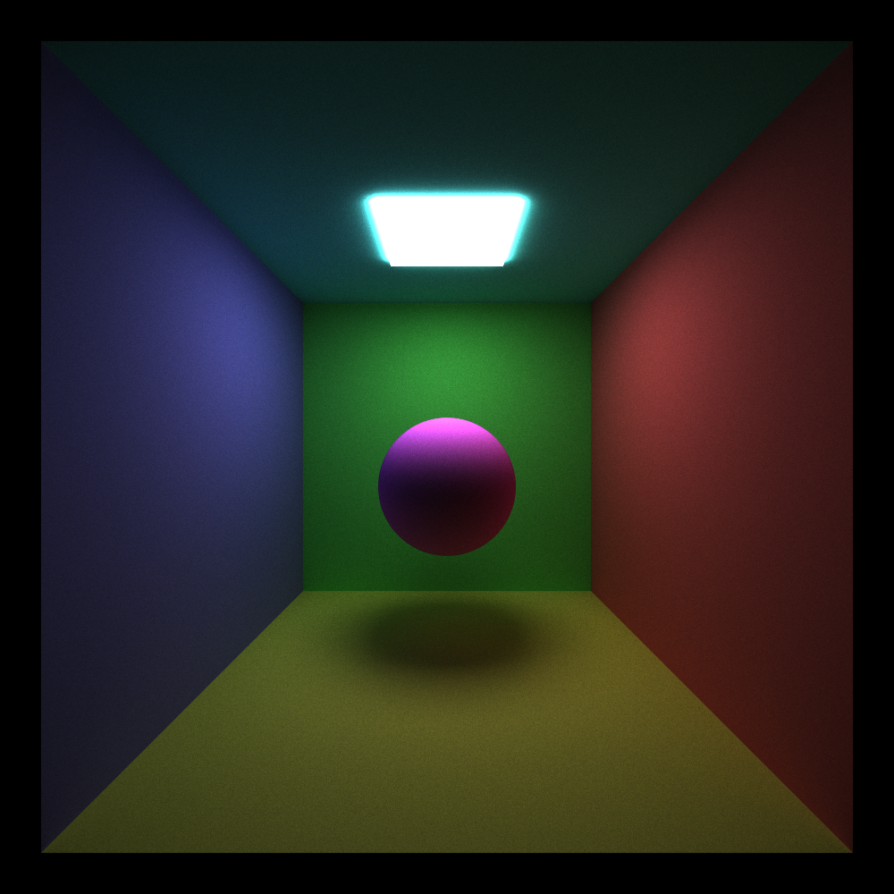

**University of Pennsylvania, CIS 5650: GPU Programming and Architecture, Project 3**

* Charles Wang
  * [LinkedIn](https://linkedin.com/in/zwcharl)
  * [Personal website](https://charleszw.com)
* Tested on:
  * Windows 11 Pro (26100.4946)
  * Ryzen 5 7600X @ 4.7Ghz
  * 32 GB RAM
  * RTX 5060 Ti 16 GB (Studio Driver 581.29)

# CUDA Path Tracer

||
|:-:|
|1280×720 / 10k samples / 8 depth|

> [!NOTE]
> I've significantly updated and refactored the base homework code. See an overview of each file's purpose in the [file list](#file-list), as well as [general grading considerations](#for-grading-considerations).

## Highlights

For a complete table of contents, use the Outline button that GitHub provides in the upper right corner of this file.

- [Introduction](#introduction)
  - [A very physically inaccurate discussion on light](#a-very-physically-inaccurate-discussion-on-light)
  - [Deviations from the real world](#deviations-from-the-real-world)
  - [Parallelization](#parallelization)
- [Program structure](#program-structure)
- [Implementation and features](#implementation-and-features)
  - [New materials](#new-materials)
    - [Lambertian BRDF](#lambertian-brdf)
    - [Perfectly specular dielectrics](#perfectly-specular-dielectrics)
  - [Stochastic sampling](#stochastic-sampling-anti-aliasing)
  - [Depth of field and thin lens camera model](#depth-of-field-and-thin-lens-camera-model)
  - [glTF model loading](#gltf-model-loading)

## Introduction

This is a path tracer written in C++, OpenGL, and GPU-accelerated via CUDA. Over the course of this README I will provide a brief explanation on the theory, walk through my program structure and implementation, discuss features, and analyze some performance benchmarks that I conducted. I'll talk about what worked, what didn't (with botched renders!), and my overall experience working on this project.

### A very physically inaccurate discussion on light

> [!NOTE]
> Feel free to skip the next few sections if you're familiar with path tracing. Jump to my [program structure](#program-structure) or the [list of features](#implementation-and-features) below.

At its core, a path tracer is attempting to simulate many real-life physics interactions, and therefore we must discuss some of that first. First, path tracing is all about light. For our purposes, we can treat the light in the world around us as _rays_, with an origin and a direction. They always come from a light source of some kind—a light bulb, the sun, my phone screen in bed at 4 AM.

Whenever a light ray _hits_ an object, it will then bounce and pick a new direction. Depending on the material that the ray intersected with, it also picks up an appropriate amount of color, mixing it with colors from all previous bounces.[^1] In addition, the properties of the material determine which direction the next bounce will take.

<!-- TODO: diagram depicting ray from sun bouncing around until it hits the eye -->

The reason we can see the world around us is because eventually, this light ray will bounce directly into our eyes. We could trace out the full _path_ that this light ray took from its light source to our eyes. This is what we're trying to simulate.

### Deviations from the real world

Since we're just trying to _simulate_ the real world, we can cheat in a number of ways.

#### Begin rays from the eye instead

The eye in this case is our virtual camera, and it is the only ray destination we care about. Therefore, it would be extremely inefficient to shoot rays _starting_ from the light source—it is highly unlikely that any ray would contribute pixel color information to our camera.

<!-- TODO: diagram depicting ray from camera around until it hits the sun -->

Instead, we can guarantee the final ray destination by shooting the initial rays from the camera. All that's left is for the ray path to intersect with a light source.

#### Rendering equation

Described by James Kajiya in his 1986 SIGGRAPH paper, the rendering equation can be written in the form

$$
L_o(\omega_o)=L_e+\int_{\Omega}f(\omega_o,\omega_i)L_i(\omega_i)(\omega_i\cdot\vec{n})\space\text{d}\omega_i
$$

I know, the math symbols spooked me too at first, but the components actually represent pretty simple ideas. This equation tells us how to calculate the light traveling on an outgoing ray direction $\omega_o$ at some particular point.

We have four main components to consider:

- $L_e$, which is the inherent light emittance at the intersection point. In other words, this point is a light source.
- A [BRDF](https://en.wikipedia.org/wiki/Bidirectional_reflectance_distribution_function) (represented by $f$), which tells us _how much_ of the light is reflected. This highly depends on the material.
- The incoming light $L_i$ from ray direction $\omega_i$. Or, the accumulated value.
- Lambert's cosine law, which relates $\omega_i$ to the surface normal.

$\Omega$ represents the hemisphere centered at the intersection, and $\text{d}\omega_i$ are all the infinitesimal ray directions that make up $\Omega$. So, we're integrating over _all_ $\omega_i$. This poses some practical problems for us.[^2]

#### Monte Carlo integration

To solve the rendering equation for an outgoing direction $\omega_o$ we have to solve the integral. Since our computer can't actually integrate over an infinite number of $\omega_i$ per intersection, a common method of resolving this issue is _randomly sampling_ a number of $\omega_i$ for each intersection, and weighing them by their probabilities of being chosen.

Furthermore, we repeatedly solve the rendering equation for every pixel in our image, and average the output colors by the number of samples taken. This allows us to _converge_ to the final image over a period of time. This can be a _long_ period of time, as we'll see.

### Parallelization

While the GPU is generally known for being good at _drawing things_, in this case we are not using it for rasterization. Monte Carlo path tracing is considered [embarrassingly parallel](https://en.wikipedia.org/wiki/Embarrassingly_parallel), and the idea is simple: calculate the color for each pixel in parallel. The path that each pixel traces to reach a light is wholly independent of one another, marking it as a good candidate.

First, I would like to clarify some terminology: an __iteration__ (or __sample__) is determining the color of each pixel _once_. We average many iterations together to converge on the final image. However, within each iteration we also perform a number of bounces bounded by the _max depth_. Each bounce progresses the path traced by each pixel by one intersection (or none if out of bounds). In other words, multiple bounces lead to one sample.

This distinction is important because there are two main ways we could have implemented parallelism, with the difference being what kind of work is being performed in a thread:

- Each thread performs one whole iteration.
- Each thread performs one bounce in a iteration. (I did this.)

By taking a incremental approach, we gain some additional optimization opportunities. We'll see later that we can get away with launching less threads if we meet certain requirements.

## Program structure

To provide a general overview of how my path tracer functions, here I describe a single execution loop of my program. One execution of this loop results in _one_ iteration of the path tracer.

> If you're curious, this corresponds with the `void loop(RenderContext* ctx, GLFWwindow* window)` function found in [`src/main.cpp`](src/main.cpp).

In each execution of the loop, until we've reached the max number of samples:

- Check if camera or GUI toggles have changed. If so, reset the samples and start over.
- Generate initial rays from the camera. That is, their origins are at the eye. 
- Perform work in inner loop:
  - For each ray, find intersections with scene geometry, if any.
  - If enabled, discard intersections that traveled out of bounds.
  - If enabled, sort the paths by the material they intersected with.
  - For each intersection, calculate its color contribution, and determine the next ray.[^3]
  - If enabled, discard intersections that have hit a light source.
  - If we've reached the max depth or we've discarded all paths, break out of the loop. Otherwise, repeat another iteration.
- Gather all the final color contribution for each pixel, and append it to our image data.
- Divide each raw pixel data by the number of samples, and send the data to OpenGL for rendering.

### File list

To better understand the role each file plays, here I offer a description of each.

- [`aabb.hpp`](src/aabb.hpp) — Creating, managing axis-aligned bounding boxes
- [`bvh.hpp`](src/bvh.hpp) 👾 — Constructing, traversing bounding volume hierarchies
- [`camera.hpp/cpp`](src/camera.hpp) — Structures for tracking camera state
- [`external.cpp`](src/external.cpp) — Necessary for compiling `tiny_gltf` and `stb_image`
- [`geometry.hpp`](src/geometry.hpp) — Structure for scene geometry objects
- [`glslUtility.hpp/cpp`](src/glslUtility.hpp) — Helper for loading, reading, and compiling GLSL
- [`gui_data.hpp`](src/gui_data.hpp) — Stores settings toggleable from ImGUI
- [`image.hpp/cpp`](src/image.hpp) — Helper class for writing the final output image
- [`intersection.hpp/cu`](src/intersection.cu) 👾 — Main intersection kernel and intersection tests
- [`main.cpp`](src/main.cpp) 👾 — Initializes and runs the program
- [`material.hpp`](src/material.hpp) — Structure for material properties
- [`mesh.hpp`](src/mesh.hpp) — Primitive structures for representing meshes
- [`path_segment.hpp`](src/path_segment.hpp) — Structure for tracking the state of a path
- [`path_tracer.hpp/cu`](src/path_tracer.cu) 👾 — Main path tracing loop and various helpers
- [`ray.hpp`](src/ray.hpp) — Ray data structure
- [`render_context.hpp/cpp`](src/render_context.hpp) — RAII wrapper to store all the state in the program
- [`sample.hpp/cu`](src/sample.cu) 👾 — Main sample kernel for calculating color contribution and determining $\omega_i$
- [`scene.hpp/cpp`](src/scene.hpp) 👾 — Scene representation, model loading, and validation
- [`tone_mapping.cuh`](src/tone_mapping.cuh) — Helpers for gamma correction
- [`utilities.cuh`](src/utilities.cuh) — Various little helper functions and miscellaneous things
- [`window.hpp/cpp`](src/window.hpp) — RAII wrapper for initializing and managing the GLFW context

Files with an alien emoji (👾) next to them indicate they contain significant functionality and/or interesting details.

## Implementation and features

### New materials

#### Lambertian BRDF

One of my first new additions to the base code is adding a Lambertian diffuse shading model. What makes this model great is how easy it is to conceptualize and implement.

<div align="center">
  
  <p>
    <i>Credits: <a href="https://pbr-book.org/4ed/Reflection_Models" target="_blank">PBRT v4</a></i>
  </p>
</div>

If we take a look at the rendering equation again, we'll see that what really differentiates one material from another is how $f(\omega_o,\omega_i)$ is implemented; that is, the BRDF. The Lambertian BRDF says that for an incoming ray $\omega_o$, the scattering of rays is _uniform_ within the hemisphere, as we can see in the diagram above. In other words, the BSDF is constant with respect to the incident angle.

Of course, I had to test this material out on the classics.

|||
|:-:|:-:|
|800×800 / 5000 samples|800×800 / 5000 samples|
|||
|800×800 / 5000 samples|800×800 / 5000 samples|

##### Cosine-weighted hemisphere sampling

While the BSDF informs us how the rays are theoretically scattered, it doesn't mean that we can't cheat in order to speed up our rendering time. The idea behind [cosine-weighted hemisphere sampling](https://pbr-book.org/4ed/Sampling_Algorithms/Sampling_Multidimensional_Functions#Cosine-WeightedHemisphereSampling) is that we should try to sample $\omega_i$ such that rays are more likely to contribute a greater amount of light than the naive way of uniformly sampling the hemisphere.

This is guided by Lambert's cosine law: rays near the "dome" of the hemisphere (i.e. smaller incidence angle) have a greater $\omega_i\cdot\vec{n}$ value than those at the bottom. Since we're manipulating our sampling methods, we have to weigh the sampled ray accordingly. The PDF for cosine-weighted sampling is given by $\frac{\text{abs}(\cos{\theta})}{\pi}$, which we divide the whole equation by.

The function for generating a cosine-weighted ray was provided for us, so I simply called it when trying to determine $\omega_i$, and divided the color contribution by the PDF.

```cpp
// Divide by PDF of cosine-weighted sampling
segment.throughput *= bsdf * lambert / pdf;

// Determine next ray origin and direction
segment.ray = {
    .origin = og_ray.at(isect.t),
    .direction = calculate_random_direction_in_hemisphere(isect.normal, rng),
};
```

#### Perfectly specular dielectrics

What's the opposite of the diffuse shading model? I... don't actually know the answer, but collapsing down from an infinite set of $\omega_i$ to a _discrete_ set of possibilities sounds right to me.

<div align="center">
  
  <p>
    <i>Credits: <a href="https://pbr-book.org/4ed/Reflection_Models" target="_blank">PBRT v4</a></i>
  </p>
</div>

The figure depicts a _pure reflection_ about the surface normal, but for dielectrics we must also consider transmission and refractions about the normal, which are governed by the material's index of refraction (IOR).

> Note that I did not implement rough dielectrics, only the perfectly specular case. I would like to revisit this in the future to completely flesh out my implementation.

Prior to achieving dieletrics, though, I needed a way to generate purely reflective and purely transmissive rays. Such materials (probably) don't exist in real life, but in path tracing we can do whatever we want. I created the following test scenes to check my implementation.

##### Pure reflection

First, complete reflection.

|||
|:-:|:-:|
|800×800 / 5000 samples|800×800 / 5000 samples|

The left scene has a single purely reflective material with everything around it set to diffuse. It's essentially a perfect mirror. The right scene inverts everything: every wall is purely reflective. The reason most of the scene is black is because the rays are leaving the scene and traveling out of bounds ~~and I never implemented environment maps :(~~

##### Pure transmission

Transmission was much trickier to implement. Two things in particular stood out.

First, IORs are always defined relative to _something_.[^4] At a given intersection point, we always need to know what medium we're _entering_ and what medium we're _leaving_, because that affects the IOR ratio. How I keep track of this is to store an additional enum in my `Intersection` data struct that informs me whether the intersection was with the outside of a surface, or inside. Depending on the surface, we may have to flip the IOR.

```cpp
/// Tracks which side of the geometry the intersection is at.
enum class Surface : char { Inside, Outside };

// GLSL/GLM refract expects the IOR ratio to be incident over target, so
// we treat the default as us starting from inside the material
if (isect.surface == Surface::Outside) {
  eta = 1.f / eta;
}
```

Second, there are specific cases where the incident angle is so large with respect to the surface normal that a refraction actually causes a reflection _back into_ the original medium. This is called [total internal reflection](https://en.wikipedia.org/wiki/Total_internal_reflection), and we have to check for this possibility. Both GLSL and `glm::refract` return zero when this occurs, which I check for and return `std::nullopt`, indicating that no transmissive ray could be generated for this intersection.

> Yes, my pure transmission function returns `std::optional<Ray>`.

Keeping these two things in mind, we can get transmission working. Take a look.

|||
|:-:|:-:|
|800×800 / 5000 samples / IOR 1.0|800×800 / 5000 samples / IOR 1.55|

These renders are... interesting. How do I interpret them? Well, an IOR of 1.0 means that no refraction occurs, causing the cube to act as a passthrough. This is what gives us the scene on the left. With an IOR of 1.55 (roughly that of glass), we get the scene on the right. I believe the black portions of the cube are due to total internal reflection, which gets mitigated a little when we combine it with reflection.

##### Finally, glass: Fresnel reflectance term

Now that we have both, let's combine them to create dielectrics! In real life, at a given intersection point such a material would split $\omega_o$ into _multiple_ rays, consisting of a reflection component and a refraction component.

To make our path tracing a little easier (and to piggyback off of the wonders of Monte Carlo) we can randomly choose whether to reflect or refract, and let the image converge over time. This is the technique chosen by [PBRT v4](https://pbr-book.org/4ed/Reflection_Models/Dielectric_BSDF) which I used as a reference. Their general discussion about [specular reflection and transmission](https://pbr-book.org/4ed/Reflection_Models/Specular_Reflection_and_Transmission) was pretty helpful as well.

What should the probability be? A simple solution is to set it to 50/50. However, this wouldn't result in an accurate physical render because we're not considering the Fresnel coefficients that dictate how much light is reflected and refracted at an intersection.

|||
|:-:|:-:|
|800×800 / 3000 samples / IOR 1.55|800×800 / 3000 samples / IOR 1.55|

While both renders above are using the IOR of glass, the one on the right looks more real because we're considering the Fresnel reflectance term when randomly deciding to reflect or refract the ray:

```cpp
auto rng = make_seeded_random_engine(curr_iter, index, curr_depth);
thrust::uniform_real_distribution<float> uniform_01;

float refl_term = fresnel_schlick(cos_theta(isect.normal, omega_o), eta);
float trans_term = 1.f - refl_term;

// For the inaccurate render, here we would be comparing against 0.5
if (uniform_01(rng) < refl_term) {
  // Treat ray as pure reflection
} else {
  // Treat ray as pure transmission
}
```

In real life, calculating the reflectance term requires solving the [Fresnel equations](https://en.wikipedia.org/wiki/Fresnel_equations). However, this is graphics so we can cheat! A popular alternative is to use Schlick's approximation, first demonstrated in 1994, which computes the term in a more efficient and simple manner. Here's some resources related to the topic that helped me:

- [Christophe Schlick's original paper](https://web.archive.org/web/20200510114532/http://cs.virginia.edu/~jdl/bib/appearance/analytic%20models/schlick94b.pdf). The approximation appears on page 7. Note this is a digital archive of the original page via the Wayback Machine.
- [The Wikipedia article about the topic](https://en.wikipedia.org/wiki/Schlick's_approximation)
- [Marc Olano's post about the topic](https://umbcgaim.wordpress.com/2010/07/15/fresnel-environment)
- [Chapter 9 of _Ray Tracing Gems II_](https://link.springer.com/chapter/10.1007/978-1-4842-7185-8_9)

Schlick's paper claims that the approximation runs _almost 32 times faster_ than the physical equations. Is this true? To test this, I also implemented the equations. For both implementations, I ran the [`glass_spheres.json`](scenes/glass_spheres.json) scene 10 times, averaging the frames for each.

||1|2|3|4|5|6|7|8|9|10|Average|
|-:|:-:|:-:|:-:|:-:|:-:|:-:|:-:|:-:|:-:|:-:|:-:|
|Schlick|61.367|61.240|61.370|61.344|61.373|61.311|61.376|61.220|61.051|61.280|**61.293**|
|Real|61.256|61.187|61.317|61.200|61.339|61.279|61.271|60.928|61.224|61.196|**61.220**|

<div align="center"><p><i>Frames per second (FPS), higher is better</i></p></div>

Schlick appears to be 0.119% faster, which is not significant enough to make a claim about anything. I am not sure why I'm not getting more drastic results. My best guess is that my testing environment is flawed or biased in some manner.

#### Roughness

While I did not implement anything close to actual PBR techniques, I was curious how far I could take my pre-existing diffuse and perfectly specular shading models to mimic actual PBR. I only had time to introduce a _roughness_ slider that simply lerps between the diffuse and specular ray directions:

```cpp
auto rng = make_seeded_random_engine(curr_iter, index, curr_depth);

glm::vec3 spec_dir = find_pure_reflection(og_ray, isect).direction;
glm::vec3 diffuse_dir = calculate_random_direction_in_hemisphere(isect.normal, rng);

segment.throughput *= material.color;
segment.ray = {
    .origin = og_ray.at(isect.t),
    .direction = glm::lerp(spec_dir, diffuse_dir, material.roughness),
};
```

I got this idea while watching Sebastian Lague's [Coding Adventure: Ray Tracing](https://www.youtube.com/watch?v=Qz0KTGYJtUk) video. Well, how ~~bad~~ good is it?

||
|:-:|
|1200×800 / 5000 samples / Roughness, left to right: 0.0, 0.2, 0.45, 0.65, 0.9 |

I would say this is not bad at all! The results are a little blobby but that's to be expected for such a cheap estimate.

### Stochastic sampling (anti-aliasing)

There are many ways to solve aliasing. One of the more easier ones to implement is stochastic sampling. The issue lies with my current initial camera ray generation code, which shoots the same exact ray direction for every sample of the pixel.

It's very easy to think of the rendered world only in terms of pixels, but for a given pixel there might be two different geometries overlapping! If we were to use the same direction every time, we would never get to sample the other geometry's color contribution. 

The solution is to add some randomness such that multiple different areas _within_ a pixel have an opportunity to be sampled.

```cpp
int index = blockIdx.x * blockDim.x + threadIdx.x;

// Derive image x-coord and y-coord from thread index
float y = glm::ceil((static_cast<float>(index) + 1.0) / camera.resolution.x) - 1.0;
float x = static_cast<float>(index - y * camera.resolution.x);

thrust::default_random_engine rng = make_seeded_random_engine(curr_iter, index, max_depth);
thrust::uniform_real_distribution<float> uniform_01;

// Reduce aliasing via stochastic sampling
y += uniform_01(rng);
x += uniform_01(rng);
```

That's it! We add a random value between $[0.0,1.0)$ so that the ray direction generated will never be the same for a given pixel.

<table>
  <tr width="100%">
    <td></td>
    <td></td>
  </tr>
  <tr width="100%">
    <td>1000×1000 / 10k samples / Stochastic sampling</td>
    <td>1000×1000 / 10k samples / No stochastic sampling</td>
  </tr>
  <tr width="100%">
    <td></td>
    <td></td>
  </tr>
</table>

The jagged edges are particularly noticeable on diagonal or curved lines. In the scene above, pay close attention to the intersection between the walls and the sphere outline.

### Depth of field and thin lens camera model

We've been adding a lot of features to the scene. What about the camera itself?

In graphics we often like using a [pinhole camera model](https://en.wikipedia.org/wiki/Pinhole_camera), which assumes that all rays must travel through a single infinitesimal point in order to hit the (imaginary) film plane. However, by instead simulating a thin lens with an aperature diameter, we can achieve more interesting effects such that depth of field. This essentially comes for free with path tracing because of how we're simulating light.

PBRT v4 (I love this book) has a great [section on thin lens models](https://pbr-book.org/4ed/Cameras_and_Film/Projective_Camera_Models#TheThinLensModelandDepthofField), which I referenced for my DOF implementation. The code is actually pretty simple: sample a random point within the lens (which is thin enough to simply be considered a circle), and use that as the initial camera ray's origin.

```cpp
thrust::default_random_engine rng = make_seeded_random_engine(curr_iter, index, max_depth);
thrust::uniform_real_distribution<float> uniform_01;

// Sample point on lens
glm::vec2 sample = sample_uniform_disk_concentric(uniform_01(rng), uniform_01(rng));
glm::vec2 lens_point = settings.lens_radius * sample;

// We want the relative distance from the camera to the plane of focus, so it
// doesn't matter what sign  the ray direction is
float t = settings.focal_distance / glm::abs(ray.direction.z);
glm::vec3 focus = ray.at(t);

// Offset ray origin by lens sample point and adjust direction such that the ray still
// intersects with the same point on the plane of focus
ray.origin += glm::vec3(lens_point.x, lens_point.y, 0.f);
ray.direction = glm::normalize(focus - ray.origin);
```

We also adjust the ray direction such that it will intersect with the imaginary focus point defined by us. This is what allows us to "focus" a particular slice of the scene, and blur everything else.

|||
|:-:|:-:|
|800×800 / 5000 samples / 12 depth|800×800 / 5000 samples / 12 depth|

Here we can see the focus point at two different places: the Stanford bunny, and the sphere.

### glTF model loading

In order to produce more interesting scenes, it would be beneficial if we could load additional models from online. To that end, I added the `tiny_gltf` library to the project, which parses all the data accessible via C++.

> Note that I do not consider scene hierarchy nor transformations. Models are loaded assuming they are defined at the world origin with zero rotation and translation, and a scale of 1. In the future I would love to add proper glTF scene traversal.

#### Creating a mesh

While the library does help us load the raw data, I still had to create a mesh from it! The minimum amount of vertex data I needed were positions and normals. I parse these out of the binary buffers and manually construct triangles out of them. There are two optimizations I make here:

- A `Triangle` struct stores three vertices, but `Vertex` structs do not store the actual position and normal values; instead, it stores a `pos_idx` and `nor_idx` into a global `position_list` and `normal_list` buffer. This allows each triangle to be much smaller in size (six `int`s versus six `glm::vec3`s).
- While parsing the glTF mesh data, I check if the current position value I want to add already exists in the global position list. If it does, I reuse the index of that position for this triangle. This allows me to send much less position data to the GPU. I do the same thing for normals.

##### Naive implementation

While on paper this should provide a speed-up, in practice my first implementation was still catastrophically slow. It went something like this:

The main issue is that checking whether a position/normal took $O(n)$ time because we have to iterate through the whole list, for every position/normal we want to add. For something like the Stanford dragon, which has over 435,000 unique position data, this made loading the model impossible.

To solve this, we need to dramatically reduce lookup times.

##### Hashing implementation

Instead of using a vector, we can use a map instead, and map each unique data point to its index. At the end, we perform one single $O(n)$ pass to transfer each map entry over to its vector index:

```cpp
// Same for positions and normals
for (const auto& [data, idx] : unique_data) {
  data_list[idx] = data;
}
```

By using a map, checking whether a data point is unique is now on average $O(1)$ instead of linear time. We can clearly see the impact in these graphs:

- TODO: graphs here lol

#### Ray-triangle intersection

My first implementation was simple and naive. For each triangle in the mesh, we perform a ray-triangle intersection test. If successful, we calculate intersection terms and return early. However, this logic is incorrect because it may not necesarily return the intersection with the *smallest* `t` value.

|**Not taking the minimum `t` value**|**Taking the minimum `t` value**|
|:-:|:-:|
|||

On the left we can see Suzanne's eyes are protruding out of the face when they should be shadowed by the eyebrows, as seen on the right.

Therefore, similar to the logic for finding the closest geometry, we keep track of the smallest `t` value found so far, and update the intersection data only if we've found a closer one. This means that we cannot return early because the closest triangle may be the last one in the triangle list.

### Intersection culling

Computing intersections with the scene is one of the most expensive operations in the path tracer.

<div align="center"></div>

Running Nsight Systems on my executable confirms this. In terms of CUDA operations, 99.6% of overall operations were spent on kernels, with 69% of that being spent on `kernel::find_intersections` itself! Meanwhile, memory operations were only 0.4% of operations, which means that we weren't memory bound.[^5]

If we show the kernel operations in the Events View and sort by duration, we can also see that `kernel::find_intersections` makes up the very top of the list, meaning it makes up the bulk of our compute time.

<div align="center">
  
  <p><i>Intersections all the way down</i></p>
</div>

So, reducing the number of intersections with the scene will be one of the most high-impact changes we can make. My path tracer offers two solutions: AABBs and BVHs.

#### Axis-aligned bounding boxes (AABB)

Axis-aligned bounding boxes are conceptually simple and also easy to implement. 

However, we'll see that AABBs are not enough. For models with many triangles, AABBs cannot help because if the intersection is successful, we will need to iterate through that model's entire triangle list regardless. Is there some way of addressing this?

Micro-optimization: pre-computing the inverse of the ray direction.

TODO: make graphs

#### Bounding volume hierarchy (BVH)

Micro-optimization: pre-computing the inverse of the ray direction before using it in the ray-AABB intersection test

Of course, having never built one before I needed to do some research. My implementation was primarily guided by the following two resources:

- Sebastian Lague: https://www.youtube.com/watch?v=C1H4zIiCOaI
- How to build a BVH series: https://jacco.ompf2.com/2022/04/13/how-to-build-a-bvh-part-1-basics/

### Partitioning path segments

Choosing to launch kernels every path bounce allows us to discard paths we don't need to perform additional computations on anymore. By discard, I mean we dynamically adjust the number of blocks we launch per kernel at runtime.

Each pixel gets a `PathSegment` which stores its current state. All of these segments are stored in a big buffer allocated on device. By partitioning the buffer, we can separate paths that are still "active" and those that aren't. I currently do this in two phases:

- Discarding paths that went out of bounds (OOB)
- Discarding paths that have intersected with a light

Partitioning the buffer also rearranges the active paths such that they're now contiguous in the buffer.

- For scenes that are less bounded by walls and have more open space, discarding OOB should improve performance.
- Scenes that are closed will not benefit from partitioning and may even decrease in performance due to the extra overhead of the algorithm not being offset.
- Scenes that may contain a large number of lights will benefit from the ray light intersection discarding step.

### Sorting paths by intersection material

Another optimization I made is to keep paths that intersected the same material contiguous in the buffer. I reference the material at an intersection via a `material_id`, a number, so `thrust::sort` can simply compare the two material IDs of an intersection to perform the sort.

The reason for this change is to reduce random accesses into the global material list within a warp. When parsing the scene JSON file, we create a `Material` struct for each possible material in the scene, and make it accessible at runtime in a buffer allocated on device. By grouping paths with the same materials together, they all benefit from the caching benefits of accessing the same material over and over within a warp. The more materials and objects in the scene, the more pronounced this effect will be.

<!--

### Codebase rewrite

I spent a significant, non-trivial amount of time rewriting the base code of this assignment. I don't often get as much free rein over a homework as I did this time, and therefore wanted to take the opportunity to explore additional C++ features in the hopes of "modernizing" the code. By this I mean reducing the following:

- Runtime global variables
- Entirely removing `new` and `delete` memory management

Now my code tries to use:

- C++ `std` libraries and their equivalent on CUDA, `libcu++`
- `<numbers>`
- `<limits>`
- `<format>`
- Smart pointers such as `std::unique_ptr`
- Namespaces to organize kernels and other related functions
- `constexpr` for compile-time calculations, although it seems CUDA doesn't have the best support for it

#### Designated initializers

I wanted to take some time to highlight C++20 _designated initializers_. Most of the data structures we're dealing with this homework are extremely simple in nature, just a `struct` with some members. With this feature I can initialize a variable as follows:

```cpp
// Here's my PathSegment struct.
struct PathSegment {
  Ray ray;
  glm::vec3 throughput;
  float radiance;
  int pixel_index;
  int remaining_bounces;
};

int main() {
  Ray ray = calculate_ray();
  int index = calculate_index();
  int max_depth = settings.get_max_depth();

  // I can now initialize it like this:
  PathSegment segment = {
      .ray = ray,
      .throughput = glm::vec3(1.f),
      .radiance = 0.f,
      .pixel_index = index,
      .remaining_bounces = max_depth,
  };

  return 0;
}
```

This allows me to still be explicit in assignments, but now I can group the initialization of all the members together, and in general I think it simply looks better.

#### Failed attempt: modeling intersections and materials

What follows was an attempt to use C++'s functional programming features. I'll explain the motives behind it, my experiencing using it, and why it eventually failed.

We should not perform work on paths that may have already completed. This can occur in two ways: the path has intersected with a light, and the path has traveled out of bounds. The third possibility, of course, is that the path has not finished traveling. It can be considered an "intermediate." 

These 3 cases informed the design of my `Intersection` object. It's just a `std::variant` in disguise, modeling the three possibilities above. In other words, it's a [sum type](https://en.wikipedia.org/wiki/Tagged_union).

```cpp
struct OutOfBounds {};
struct HitLight { /* Data members here */ };
struct Intermediate { /* Data members here */ };

using Intersection = cuda::std::variant<Intermediate, HitLight, OutOfBounds>;
```

See [`src/intersection.cuh`](src/intersection.cuh).

If the ray went out of bounds, we don't need to store any information. However, the data we need when we've intersected with a light is different from when we're still traveling through the scene. This structure allows me to expose different data depending on what *type* the intersection is.

##### Materials

Materials followed a similar pattern.

##### Why it failed

At first everything was gravy. But then I ran into other bugs. And, when the two most important kernel invocations in your program are wrapped in confusing C++ function calls, it makes it a little difficult to debug errors.

-->

## Credits

- CIS 5650 staff for the base code
- Lewis Ghrist for the path discarding test scene ([`scenes/path_discarding.json`](scenes/path_discarding.json))

### Third party code

- I use [`tinygltf`](https://github.com/syoyo/tinygltf) for loading the initial glTF model data.

### Custom models

The repo contains a lot of scenes with models taken from elsewhere. Here are their sources.

- `suzanne`, `blender_cube`, `plane`: exported from Blender.
- `utah_teapot`: I tried finding the original source model. The closest I could find is from [David E. Johnson's University of Utah page](https://users.cs.utah.edu/~dejohnso/models/models.html). I converted the "Boolean Combined Teapot" .stl file to glTF.

#### Stanford 3D Scanning Repository

Repository can be found at [graphics.stanford.edu/data/3Dscanrep](https://graphics.stanford.edu/data/3Dscanrep/).

- `stanford_bunny`: converted to glTF by me from the original PLY format.
- `stanford_dragon`: converted to glTF by me from the original PLY format.

#### Khronos glTF Sample Assets

The following models are taken from the repository at [github.com/KhronosGroup/glTF-Sample-Assets](https://github.com/KhronosGroup/glTF-Sample-Assets).

- `avocado`
- `damaged_helmet`

## Future work

Some stuff I would do differently next time:

- Store geometry in world space to prevent having to transform to local object space first, perform computations, and then transform position/normals back
- In terms of development, breaking problems into much smaller parts and individually testing each before moving on. I got bit way too many times because I wrote everything at once and then I had to debug the whole mess.

## For grading considerations

I've somewhat modified the [CMakeLists.txt](CMakeLists.txt) file. Here are the changes that I've made:

- Moved the `include_directories("${CMAKE_CUDA_TOOLKIT_INCLUDE_DIRECTORIES}")` call out of the `if(UNIX)` branch to make it available on Windows as well
- Renamed and moved various file and updated `headers` and `sources` accordingly.
- Renamed `stb.cpp` to `external.cpp` because I added `tiny_gltf` as well.
- Updated to C++20.

### Changes to the scene file format

I've removed the `FILE` key from the `Camera` object because I've modified my output image name to reuse the JSON file name. I've also added additional material types:

- `Unknown`
- `PureReflection`
- `PureTransmission`
- `PerfectSpecular`
- `Pbr`

I removed the `Specular` material type because I didn't technically implement rough specular surfaces.

I use VS Code for development, so all my relative paths in the scene files are different from the ones used in Visual Studio. I find that I have to remove two of the "../" for Visual Studio to work.

I added a new `gltf` type for the `TYPE` key under the `Objects` array. This allows you to load arbitrary glTF models (both .gltf and .glb files are supported). When the `TYPE` is `gltf`, my code checks for an additional key called `PATH`. This is an absolute or relative (to the executable directory) path to the glTF model you wish to load. You also have an option to build a BVH for the model. This is controlled by the `BUILD_BVH` key. Set it to `true` or `false`.

I added a `NAME` key under the `Objects` array because I wanted a way to keep track of what each geometry's role was supposed to be. This information could also be useful for debugging purposes.

### Testing

Some other stuff I've changed that should probably be pointed out:

- Pressing Esc does not save an image anymore. Pressing S still does this.
- I had to update the `stb_image` and `stb_image_write` versions because otherwise `tiny_gltf` would not compile.

[^1]: In actuality, the color of an object is determined by the light wavelengths _not_ absorbed, so the idea of "picking up" the object's color is purely a construct for understanding the path tracer.
[^2]: Small problems such as, you know, having a finite amount of memory in my computer.
[^3]: We're technically finding the _previous_ ray, since we're choosing a $\omega_i$ to travel to. Remember that we're working backwards from the camera to a light source.
[^4]: For my path tracer, one side of the ratio is always a vacuum, which has an IOR of 1.0. This simplifies a lot of calculations.
[^5]: This could just mean my kernels were so inefficient that they were even slower than memory operations, which is a very likely possibility.
